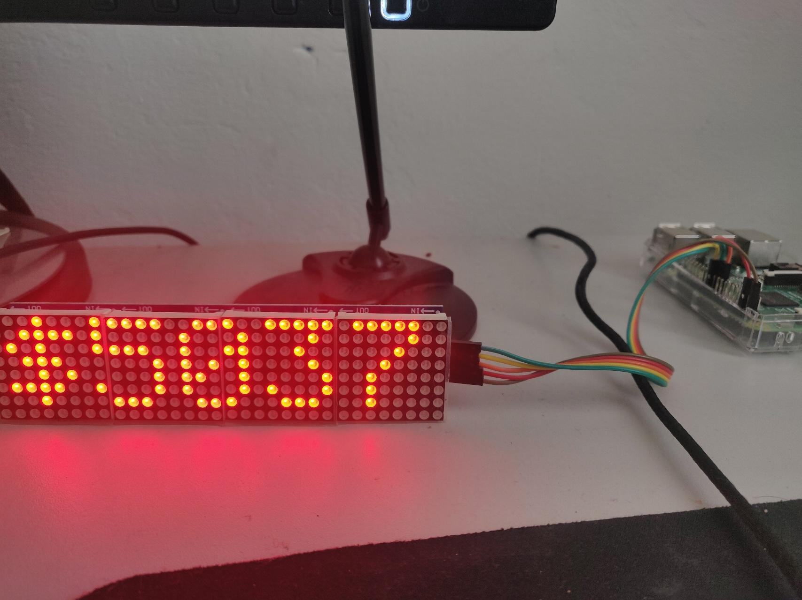

# BitcoinTickerLED
Display the realtime Bitcoin price on an LCD matrix

## pictures in action
  

## Components
4 in 1 Multiple Modules Microcontroller For MAX7219__
https://www.ebay.co.uk/itm/264120451110

## Prequisities 

Run sudo raspi-config__
Arrow down to P4 SPI__
Select yes when it asks you to enable SPI__
__
pip install --upgrade luma.led_matrix__
pip install lomond__

## Raspberry Pi3 Connection
 

